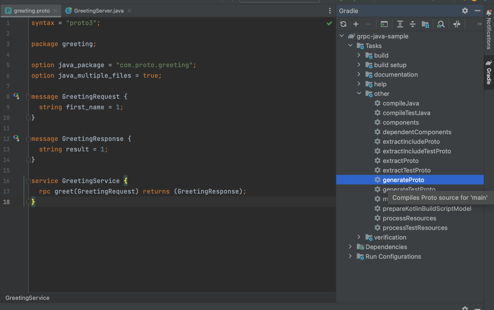

A sample gRPC project with a greeter server/client.

**generateProto**
- Running generateProto task after defining the data structures in proto file.

**Auto generated classes by generateProto task**

**Server:**
- Creating the server, opening port, starting and shutting the server in server class:

**Client:**

**Service Implementation:**

